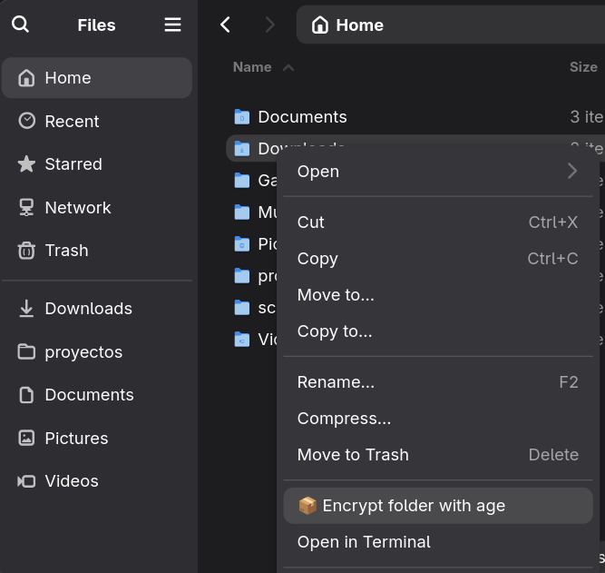
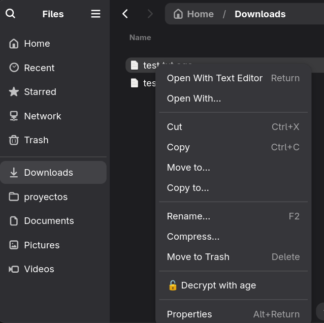
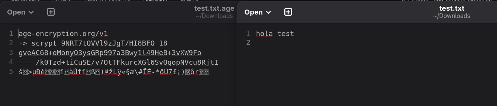

# 🔐 AGE Encryption - Nautilus Extension

Complete Nautilus (GNOME Files) extension for encrypting and decrypting files using **age** (Actually Good Encryption).


## 📋 Features

### ✨ Main Functionalities

- **🔒 Encrypt individual files** - Right-click → Encrypt with age
- **🔓 Decrypt .age files** - Right-click on .age files → Decrypt with age
- **📦 Encrypt complete folders** - Compresses (tar.gz) and encrypts in a single step
- **🗑️ Optional secure deletion** - Deletes original files with `shred` (3 passes)
- **✅ Integrity verification** - Validates .age files before decryption
- **🔄 Batch encryption** - Select multiple files and encrypt all at once
- **📦 Automatic extraction** - Decompresses encrypted folders automatically
- **🔔 Notifications** - System notifications when operations complete
- **🎨 Intuitive interface** - Graphical dialogs with Zenity

### 🛡️ Security

- **Algorithm:** ChaCha20-Poly1305 (same used by Google, Cloudflare, WireGuard)
- **Key derivation:** scrypt (resistant to GPU/ASIC attacks)
- **Authentication:** Built-in (detects modifications)
- **No dangerous configuration:** age is designed to be secure by default

## 📸 Screenshots

### Encrypt a file


### Encrypt a folder


### Decrypt a file


### Encrypted vs Original file


## 📦 Requirements

### Operating System
- Debian 13+ (Trixie) or Debian 14+
- Ubuntu 24.04+ (Noble) or higher
- Any distribution with GNOME/Nautilus

### Dependencies
All are installed automatically:
- `python3-nautilus` - Python bindings for Nautilus
- `age` - Encryption tool
- `zenity` - Graphical dialogs
- `libnotify-bin` - System notifications
- `coreutils` - Basic utilities (includes `shred`)

## 🚀 Installation

### Method 1: Automatic installation (recommended)

```bash
# 1. Download the files
git clone https://github.com/your-username/age-nautilus-extension.git
cd age-nautilus-extension

# 2. Run the installer
chmod +x install-age-nautilus.sh
./install-age-nautilus.sh
```

Done! The extension is now installed and working.

### Method 2: Manual installation

```bash
# 1. Install dependencies
sudo apt update
sudo apt install python3-nautilus age zenity libnotify-bin

# 2. Create extensions directory
mkdir -p ~/.local/share/nautilus-python/extensions

# 3. Copy the extension
cp age-nautilus-extension.py ~/.local/share/nautilus-python/extensions/
chmod +x ~/.local/share/nautilus-python/extensions/age-nautilus-extension.py

# 4. Restart Nautilus
nautilus -q
```

## 📖 Usage

### Encrypt a file

1. Open Nautilus (GNOME Files)
2. Navigate to your file
3. **Right-click** → **"🔒 Encrypt with age"**
4. Enter your password (twice to confirm)
5. Optionally, accept deleting the original file
6. ✅ Creates `file.ext.age`

### Encrypt multiple files

1. **Select multiple files** (Ctrl + Click)
2. **Right-click** → **"🔒 Encrypt N files with age"**
3. Enter password
4. All files are encrypted with the same password

### Encrypt a complete folder

1. **Right-click on a folder** → **"📦 Encrypt folder with age"**
2. Enter password
3. Creates `folder.tar.gz.age` (compressed and encrypted)
4. Optionally, accept deleting the original folder

### Decrypt files

1. **Right-click on .age file** → **"🔓 Decrypt with age"**
2. Enter your password
3. Original file is recovered
4. If it's a folder (`.tar.gz`), asks if you want to extract it

## 🎯 Use Case Examples

### Case 1: Confidential documents

```
secret-document.pdf
→ Encrypt with age
→ secret-document.pdf.age (encrypted)
→ Delete original ✓
```

### Case 2: Complete project backup

```
my-project/
  ├── code/
  ├── documentation/
  └── data/

→ Encrypt folder with age
→ my-project.tar.gz.age (everything compressed and encrypted)
```

### Case 3: Sharing encrypted files

```
1. Encrypt: photo.jpg → photo.jpg.age
2. Share photo.jpg.age via email/USB
3. Share password through another channel (Signal, phone call)
4. Recipient: Right-click → Decrypt with age
```

## 🔧 Advanced Configuration

### Change number of shred passes

Edit `age-nautilus-extension.py`:

```python
# Line ~565
subprocess.run(['shred', '-vfzu', '-n', '35', file_path])  # 35 passes (Gutmann)
```

### Disable secure deletion

Comment these lines in the `on_encrypt_files` method:

```python
# if delete_originals:
#     self.secure_delete(file_path)
```

## 🐛 Troubleshooting

### Extension doesn't appear in Nautilus

```bash
# Verify python3-nautilus is installed
dpkg -l | grep python3-nautilus

# Verify extension is in the right place
ls -la ~/.local/share/nautilus-python/extensions/

# Restart Nautilus
nautilus -q
killall nautilus
nautilus &
```

### Error: "age is not installed"

```bash
# Install age
sudo apt install age

# Verify installation
age --version
```

### Dialogs don't appear

```bash
# Verify zenity
which zenity

# If not installed
sudo apt install zenity
```

### Notifications don't work

```bash
# Verify notify-send
which notify-send

# If not installed
sudo apt install libnotify-bin
```

### Permission error

```bash
# Grant execution permissions
chmod +x ~/.local/share/nautilus-python/extensions/age-nautilus-extension.py
```

## 🔐 Security and Best Practices

### Strong passwords

✅ **GOOD:**
- `correct-horse-battery-staple-2024-secure`
- `Tr0ub4dor&3-MySecretP@ssw0rd!`
- Minimum 20 characters
- Mix of words, numbers, symbols

❌ **BAD:**
- `password123`
- `qwerty`
- Your name
- Short passwords

### Sharing encrypted files

1. **NEVER** send the .age file and password through the same channel
2. .age file → Email/USB
3. Password → Signal/Phone call/SMS
4. For maximum security: share password in person

### File verification

The extension automatically verifies that .age files are valid before attempting to decrypt them.

### Secure deletion

- `shred` overwrites the file 3 times
- Makes forensic recovery nearly impossible
- Only useful on HDD drives (not on SSD/NVMe due to wear leveling)

## 📊 Comparison with Other Solutions

| Feature | age-nautilus | GPG-Nautilus | Veracrypt | zip -e |
|---------|-------------|--------------|-----------|--------|
| Ease of use | ⭐⭐⭐⭐⭐ | ⭐⭐⭐ | ⭐⭐ | ⭐⭐⭐⭐ |
| Security | ⭐⭐⭐⭐⭐ | ⭐⭐⭐⭐ | ⭐⭐⭐⭐⭐ | ⭐⭐ |
| Speed | ⭐⭐⭐⭐⭐ | ⭐⭐⭐ | ⭐⭐⭐ | ⭐⭐⭐⭐ |
| GUI Integration | ⭐⭐⭐⭐⭐ | ⭐⭐⭐ | ⭐⭐⭐⭐ | ⭐ |
| Modern | ⭐⭐⭐⭐⭐ | ⭐⭐⭐ | ⭐⭐⭐⭐ | ⭐ |

## 🗑️ Uninstallation

```bash
# Remove the extension
rm ~/.local/share/nautilus-python/extensions/age-nautilus-extension.py

# Restart Nautilus
nautilus -q

# Optional: uninstall dependencies
sudo apt remove python3-nautilus age zenity
```

## 🤝 Contributing

Found a bug? Have an idea for improvement?

1. Fork the repository
2. Create a branch: `git checkout -b feature/new-feature`
3. Commit: `git commit -am 'Add new feature'`
4. Push: `git push origin feature/new-feature`
5. Open a Pull Request

## 📝 Changelog

### v1.0.0 (2025-12-27)
- ✨ Initial release
- 🔒 Individual file encryption
- 📦 Complete folder encryption
- 🔓 Decryption with verification
- 🗑️ Optional secure deletion
- 🔔 System notifications
- 🎨 Intuitive UI with Zenity

## 📄 License

MIT License - See LICENSE file for details

## 👏 Credits

- **age** - Filippo Valsorda (Google Crypto Team)
- **Nautilus** - GNOME Project
- **Extension** - Created with ❤️ on a Saturday night

## 🔗 Useful Links

- [age GitHub](https://github.com/FiloSottile/age)
- [age Documentation](https://age-encryption.org/)
- [Nautilus Python](https://wiki.gnome.org/Projects/NautilusPython)
- [age Specification](https://c2sp.org/age)

---

**Found it useful?** ⭐ Star the repository!

**Questions?** Open an issue on GitHub

**Secure encryption for everyone! 🔐**
